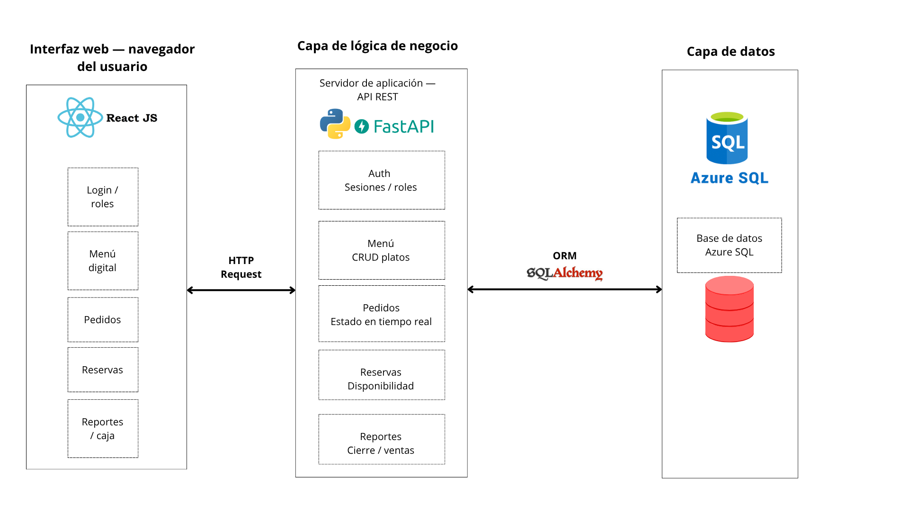

# Arquitectura del Sistema — SIGR v1.0.0

El SIGR implementa una **arquitectura de tres capas** desacoplada, donde el frontend React se comunica con el backend FastAPI a través de una API REST, y FastAPI accede a AzureSQL mediante SQLAlchemy.

---

## Stack tecnológico

| Capa | Tecnología |
|---|---|
| Frontend | React.js (Vite) |
| Backend | FastAPI — Python 3.12+ |
| ORM | SQLAlchemy 2.x |
| Base de datos | AzureSQL |
| Autenticación | JWT (python-jose) + bcrypt |
| Entorno virtual | uv |

---

## Diagrama de arquitectura

---

## Descripción detallada de cada capa

### Capa de presentación — React.js

Interfaz web construida con React.js. Cada módulo tiene sus propias páginas y componentes. El estado de autenticación se gestiona con Context API y el token JWT se almacena en memoria de sesión.

**Comunicación con el backend:** todas las peticiones van al prefijo `/api/v1/` con el header `Authorization: Bearer <token>`.

| Rol | Páginas accesibles |
|---|---|
| Cliente | Menú digital, registro de reservas, mis reservas |
| Mesero | Menú digital, crear y seguir pedidos por mesa |
| Administrador | Todo lo anterior + usuarios, reportes y cierre de caja |

---

### Capa de lógica de negocio — FastAPI

Cada módulo del sistema sigue la misma estructura interna de cuatro archivos:

| Archivo | Responsabilidad |
|---|---|
| `models.py` | Modelos SQLAlchemy que mapean las tablas de PostgreSQL |
| `schemas.py` | Esquemas Pydantic para validación de entrada y serialización de salida |
| `router.py` | Endpoints FastAPI agrupados por módulo con prefijo de ruta |
| `service.py` | Lógica de negocio, consultas a la base de datos y reglas del dominio |

**Documentación automática:** FastAPI genera Swagger UI en `/docs` y ReDoc en `/redoc` a partir de los esquemas Pydantic, sin configuración adicional.

---

### Capa de datos — AzureSQL + SQLAlchemy

| Componente | Rol |
|---|---|
| SQLServer | Motor de base de datos relacional principal |
| SQLAlchemy 2.x (async) | ORM para definir modelos y ejecutar consultas desde Python |

---

## Comunicación entre capas

| Origen | Destino | Mecanismo |
|---|---|---|
| React (frontend) | FastAPI (backend) | HTTP REST + JSON, header JWT |
| FastAPI | AzureSQL | SQLAlchemy async + asyncpg |
